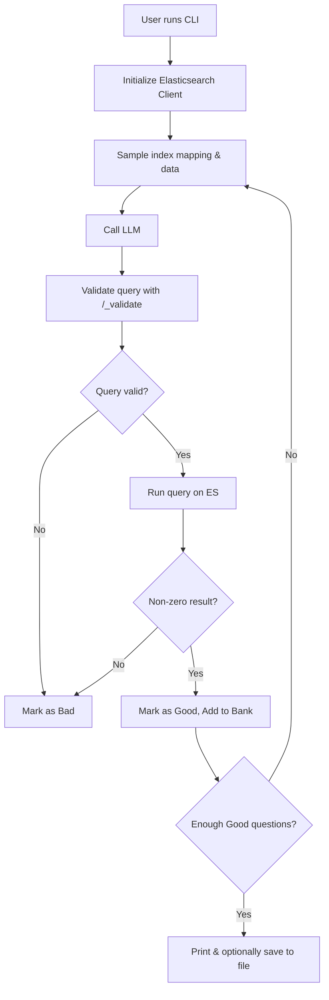

# ElasticGPT Agentic Question Generator

Generate realistic, exam-level questions for the Elastic Certified Engineer Exam, using your own Elasticsearch data.


## 🛠️ Tech Stack

- **Python 3.10+**: Main programming language.
- **Elasticsearch Python Client**: For connecting to and querying your Elasticsearch cluster.
- **BAML**: Used for defining the agentic loop and prompt structure for question generation.
- **OpenAI GPT-4o**: LLM backend for generating questions and answers.
- **Typer**: For building a user-friendly CLI.
- **Rich**: For pretty terminal output.


## 🤖 Agentic Loop: How Question Generation Works

This project implements an verifiable *agentic* system to generate, validate, and curate exam questions:

1. **Initialize Elasticsearch Client**: Connects to your running Elasticsearch instance using credentials from environment variables.
2. **Sample Data**: Randomly selects a document and retrieves the index mapping from your specified index.
3. **Generate Question**: Calls the BAML-defined function (`GenerateElasticCertificationQuestion`) which uses OpenAI GPT-4o to generate a question/answer pair, tailored to your data and a randomly chosen category.
4. **Validate**: 
   - Uses the Elasticsearch `_validate` endpoint to check if the generated query is syntactically correct.
   - Executes the query to ensure it returns a non-zero result (i.e., the answer is meaningful for your data).
5. **Curate**: Only questions that pass both validation steps are marked as "Good" and added to the question bank.
6. **Repeat**: The 'while' loop continues until the desired number of valid questions is reached.
7. **Save**: Optionally, you can save the curated questions to a Markdown file.


## ⚙️ Setup & Requirements

1. **Elasticsearch Instance**: You must have a running Elasticsearch cluster with an index containing real data.
2. **Environment Variables**: Set your connection details in a `.env` file or via environment variables:
   - `ES_URL`: Your Elasticsearch URL (e.g., `http://localhost:9200`)
   - `API_KEY`: Your Elasticsearch API key

   Example `.env`:
   ```
   ES_URL=http://localhost:9200
   API_KEY=your_api_key_here
   ```

3. **Install Dependencies**:
   ```bash
   uv sync
   ```


## 🚀 Usage

Run the CLI to start generating questions:

```bash
python src/elasticGPT/QueryGenerator.py
```

You'll be prompted for:
- The index to use (must already exist and contain data)
- The number of questions to generate
- Whether to save the questions to a file

Questions are validated both syntactically and by actual execution, ensuring only meaningful, correct questions are kept.


## 💾 Saving Questions

If you choose to save, questions are written to a Markdown file in the `generations/` directory, named with the index and timestamp.


## 🧩 Project Structure

```plaintext
elasticGPT/
│
├── baml_src/
│   └── elastic.baml         # BAML spec: defines categories, data model, and LLM prompt logic
│
├── src/elasticGPT/
│   ├── QueryGenerator.py    # Main CLI: agentic loop, validation, saving
│   └── utils/helpers.py     # Helper functions: validation, pretty printing, saving
│   └── baml_client/         # BAML client integration and type definitions
│
├── generations/             # Saved question sets
├── .env.example             # Example environment file
└── README.md
```

---

## 🗺️ Code Flow Diagram

Here's a high-level overview of the main agentic loop and supporting modules:




## 📚 Extending & Customizing

- **Categories & Prompting**: Edit `baml_src/elastic.baml` to add new categories or tweak the prompt logic.
- **Validation Logic**: See `src/elasticGPT/utils/helpers.py` to adjust what counts as a "Good" question.
- **Output Format**: Modify `save_questions_to_markdown` for custom export formats.

## 📝 Contributing

Feel free to open issues or PRs for improvements, new features, or bug fixes!


